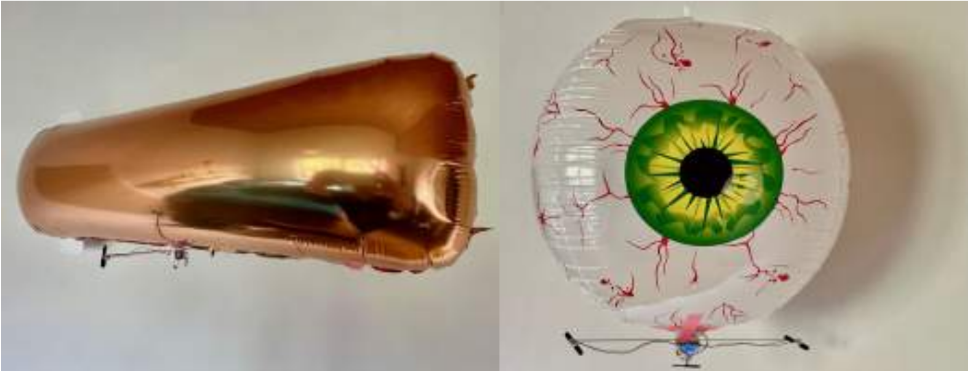
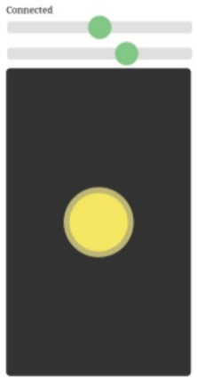

# Wifi-Blimp-Browser
Wifi bestuurde (vanuit een browser ) blimp (zeppelin) op een ESP8266 (NodeMCU, Wemos D1 mini) of ESP32/ESP32C3 en een optionele gyro GY-521 of LSM6DS3TR-C



Wifi-Blimp-Browser bevat de software voor het aansturen van op afstand bestuurbare voertuigen (zoals blimps/zeppelins) ontwikkeld door MasynMachien gebaseerd op ESP8266 of ESP32.. De besturing vindt plaats via een interactieve webinterface in de browser, waardoor er geen aparte app geïnstalleerd hoeft te worden.

Het project maakt gebruik van een IMU (gyroscope) voor stabilisatie en biedt ondersteuning voor verschillende hardwareconfiguraties.

Dit project gaat over het besturen van voertuigen (blimp/zeppelin, hovercraft) met bidrectionele linker- en rechter DC-motoren.  Wil je liever een hovercraft met servo besturen, ga dan naar het ander project [Wifi-Hovercraft-Browser](https://github.com/FedericoBusero/Wifi-Hovercraft-Browser)

## Kenmerken

* **Web-based Interface:** Bedien je voertuig via een joystick en sliders in je browser (Chrome, Safari, Firefox).
* De communicatie verloopt via **Wifi** m.b.v. een **SoftAP** (WifiPoint). Het voertuig heeft dus een eigen access point aan boord, er is dus geen echte internetverbinding.
* Het is ontwikkeld voor zeppelins(blimp) maar er zijn ook configuratievoorbeelden voor hovercrafts (die met linker- en rechtermotor werken, dus niet met servo).
* **Gyro-stabilisatie:** Maakt gebruik van de `FastIMU` library en een Low Pass Filter voor stabiele vlucht of vaart.
* **Cross-platform:** Ondersteuning voor ESP8266 (Lolin D1 Mini) en diverse ESP32 varianten (C3 Supermini, S2 Mini, WROOM).

## Hardware Vereisten

Afhankelijk van de gekozen configuratie in `config.h`:
* **Microcontroller:** ESP8266 of ESP32 (C3, S2, etc.).
* **IMU:** MPU6050 (via I2C op adres 0x68).
* **3 DC-Motoren:** Ondersteuning voor DC-motoren en bidirectionele motoren (afhankelijk van het type: Blimp of Hover3M).
* 3-voudige **H-brug**
* **LiPo-batterij**
* **Ballon** met helium gevuld

## Installatie & Gebruik

### 1. Bibliotheken installeren
Zorg dat de volgende libraries in je Arduino IDE zijn geïnstalleerd (ESP32C3-versie):
* [ArduinoWebsockets](https://github.com/gilmaimon/ArduinoWebsockets) door Gil Maimon.
* [FastIMU](https://github.com/LiquidCGS/FastIMU) (minimaal versie 1.2.8).
* [AsyncTCP](https://github.com/me-no-dev/AsyncTCP)
* [ESPAsyncWebSrv](https://github.com/dvarrel/ESPAsyncWebSrv), versie 1.2.9

### 2. Configuraties
Open `config.h` en kies je hardwareprofiel door de relevante `#define` te uncommenten:
```cpp
// Voorbeeld: Kies voor een Blimp met 3 motoren op een ESP32C3
#define ENV_BLIMP_ESP32C3_WROOM_V3
```
Dit is de blimp die gebruikt is op Hasselt 2025, Makerfair Eindhoven 2025 en Makerfait Gent 2026.

### 3. Uploaden
Upload de code naar je ESP-board via de Arduino IDE of PlatformIO.

### 4. Verbinding maken
1.  Zoek op je smartphone of computer naar het wifi-netwerk met de naam `hover-xxxx` of `blimp-xxxx`.
2.  Gebruik het standaard wachtwoord: `12345678`.
3.  Open je browser (Chrome, Firefox, Safari, ..) en ga naar: `http://192.168.4.1` of `http://h.be`.

## Bediening


De webinterface bevat de volgende elementen:
* **Bovenste Statusbalk:** Toont de verbindingsstatus (en optioneel de gyro draaisnelheid) en (indien ondersteund) de batterijspanning.
* **P-Factor Slider:** Regelt de gevoeligheid van de gyroscoop-regeling.
* **Zweefmotor Slider:** Stelt de kracht van de motor in die het voertuig laat zweven.
* **Joystick:** Bestuurt de richting en de stuwkracht van de motoren.

## Tips
* **Wifi-behoud:** Omdat het netwerk geen internet heeft, kan je telefoon vragen of je verbonden wilt blijven. Kies "Ja".
* **Calibratie:** De batterijspanning kan gecalibreerd worden in de code met de `VOLTAGE_FACTOR`.
* **Noodstop:** Bij verlies van de verbinding (Disconnect) zullen de motoren uit veiligheidsoverwegingen stoppen.

## Hoe maak je een blimp/zeppelin?
Voor workshops kan je terecht bij [masynmachien](https://www.masynmachien.be/)
* De Nederlandstalige bouwbeschrijving van masynmachiens Wifi bestuurde "zeppelin" bind je [hier](https://drive.google.com/file/d/1kgbARLVWbW1ju_md69NMXsFJ5Pm3_wp5/view?pli=1)
* English build instructions of MasynMachien's Wi-Fi Controlled "Zeppelin" can be found [here](https://drive.google.com/file/d/1wyDzlwFDYCTluwN-NWTXZ2bfNyR8x3mo/view)
---
*Ontwikkeld voor hobbyisten en educatieve doeleinden.*
