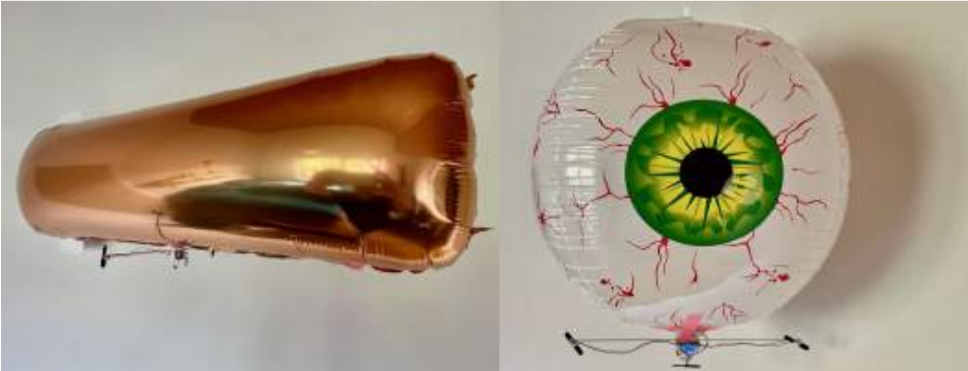
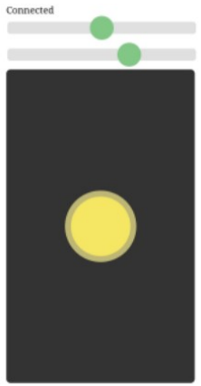

# Wifi-Blimp-Browser
Wi-Fi controlled (from browser) blimp (airship, dirigeable, zeppelin) on ESP8266 or ESP32-C3, with optional gyro (e.g. GY-521 or LSM6DS3TR-C).



Wifi-Blimp-Browser contains the software for remote controlled vehicles (such as blimps) developed by masynmachien, based on the ESP8266 or ESP32. Control is done via an interactive web interface in the browser, meaning there is no need to install a separate app.

The project uses an IMU (gyroscope) for stabilising straight-line movement and supports various hardware configurations.

This project focuses on controlling vehicles (blimps, hovercrafts) with bidirectional left and right DC motors and a third DC motor for lift (uni- or bidirectional) or hovering. If you’d prefer to control a hovercraft using a servo, please see the other project, [Wifi-Hovercraft-Browser](https://github.com/FedericoBusero/Wifi-Hovercraft-Browser)

## Features
* **Web-based interface:** Control your vehicle using a joystick and sliders in your browser (Chrome, Safari, Firefox).
* Communication takes place via **Wi-Fi** using a **SoftAP** (WifiPoint). The vehicle therefore has its own on-board access point, so no actual internet connection is required.
* It was developed for airships (blimps, airships), but there are also configuration examples for hovercrafts (the type with left and right motors, rather than servos).
* **Gyro stabilisation:** Uses the FastIMU library and a low-pass filter for stable flight or navigation.
* Although the configuration is based on the ESP32-C3, the code is compatible with other ESP32 or ESP8266 chips.

## Hardware Requirements
Depending on the configuration selected in config.h:
* **Microcontroller**: ESP32-C3
* **IMU**: e.g. LSM6DS3TR-C or MPU6050
* **3 DC motors**: Support for DC motors (uni- and bidirectional, depending on the type: Blimp or Hover3M). These consist of 2 motors for left/right steering and 1 motor for up/down control.
* **3 H-bridges** or 2 H-bridges and a FET
* 1s **LiPo battery**
* **Helium**-filled balloon

## Installation & Use

### 1. Installing Libraries
Ensure that the following libraries are installed in your Arduino IDE (ESP32C3 version):
* [ArduinoWebsockets](https://github.com/gilmaimon/ArduinoWebsockets) by Gil Maimon.
* [FastIMU](https://github.com/LiquidCGS/FastIMU) (version 1.2.8 or higher).
* [AsyncTCP](https://github.com/me-no-dev/AsyncTCP)
* [ESPAsyncWebSrv](https://github.com/dvarrel/ESPAsyncWebSrv), version 1.2.9

### 2. Configurations
Open config.h and select your hardware profile by uncommenting the relevant #define:

For example for a blimp with 3 motors and the masynmachien ESP32-C3 based board used at Maker days Eindhoven 2025, Maker Day Hasselt 2025 and Maker Faire Ghent 2026:
```cpp
#define ENV_BLIMP_ESP32C3_WROOM_V3
```
or
```cpp
#define ENV_BLIMP_ESP32C3_WROOM_V3_REVERSED_MOTORS
```
For the same board and the new motors as used by Windreiter.

### 3. Upload
Upload the code to your ESP board via the Arduino IDE or PlatformIO. Depending on the code already on it, it might be needed to put the microcontroller in boot-mode for uploading.

### 4. Connect
1. On your smartphone, tablet or computer, search for the Wi-Fi network named hover-xxxxxx or blimp-xxxx.
2. Use the default password: 12345678.
3. On Android devices it might be needed to switch off mobile internet.
4. Open your browser (Chrome, Firefox, Safari, etc.) and go to: http://h.be or http://192.168.4.1
    
## Control


The web interface contains the following elements:
* **Top Status Bar**: Displays the connection status (and optionally the gyro rotation speed) and (if supported) the battery voltage.
* **Top Slider**: depending on the configuration, adjusts the maximum power of the thrust motors or the sensitivity of the gyroscope control (P-factor).
* **Second Slider**: Sets the power of the motor makes the vehicle climbing and descending or hovering
* **Joystick**: Controls the direction and thrust of the motors.De webinterface bevat de volgende elementen:

## Tips
* **Keeping Wi-Fi connection**: Since the network doesn’t have internet access, your phone may ask if you want to stay connected. Select “Yes.”
* **Calibration**: The battery voltage can be calibrated in the code using the VOLTAGE_FACTOR.
* **Emergency stop**: If the connection is lost (Disconnect), the motors will stop for safety reasons.
 
## How to Build a blimp/zeppelin?
* For workshops, contact masynmachien
* De Nederlandstalige bouwbeschrijving van masynmachiens wifi bestuurde "zeppelin" vind je vind je [hier](https://drive.google.com/file/d/1kgbARLVWbW1ju_md69NMXsFJ5Pm3_wp5/view?pli=1)
* English build instructions for MasynMachien’s Wi-Fi-controlled “zeppelin” can be found [here](https://drive.google.com/file/d/1wyDzlwFDYCTluwN-NWTXZ2bfNyR8x3mo/view)
---
*Developed for hobbyists and educational purposes.*
